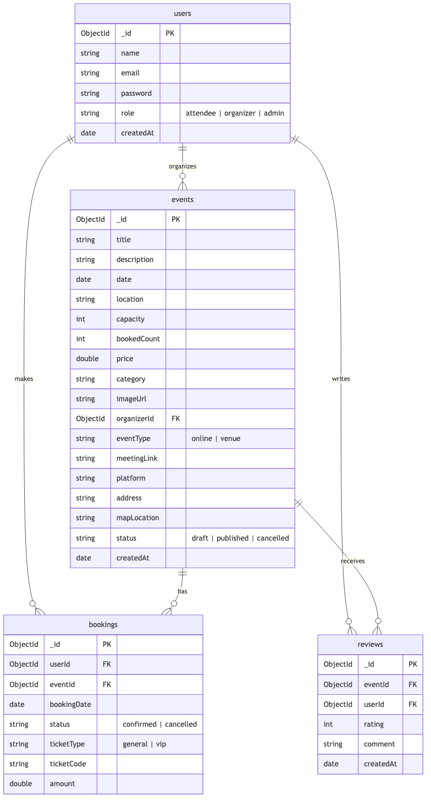
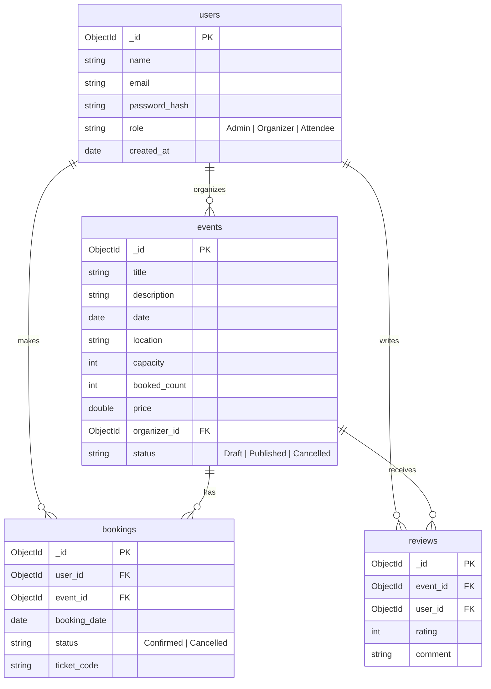

# ER Diagram

This Entity-Relationship diagram defines the **MongoDB Schema** structure, detailing the relationships between Users, Events, Bookings, and Reviews.

Mermaid Source

```mermaid
erDiagram
    users {
        ObjectId _id PK
        string name
        string email
        string password_hash
        string role "Admin | Organizer | Attendee"
        date created_at
    }

    events {
        ObjectId _id PK
        string title
        string description
        date date
        string location
        int capacity
        int booked_count
        double price
        ObjectId organizer_id FK
        string status "Draft | Published | Cancelled"
    }

    bookings {
        ObjectId _id PK
        ObjectId user_id FK
        ObjectId event_id FK
        date booking_date
        string status "Confirmed | Cancelled"
        string ticket_code
    }

    reviews {
        ObjectId _id PK
        ObjectId event_id FK
        ObjectId user_id FK
        int rating
        string comment
    }

    users ||--o{ events : "organizes"
    users ||--o{ bookings : "makes"
    events ||--o{ bookings : "has"
    users ||--o{ reviews : "writes"
    events ||--o{ reviews : "receives"
```

