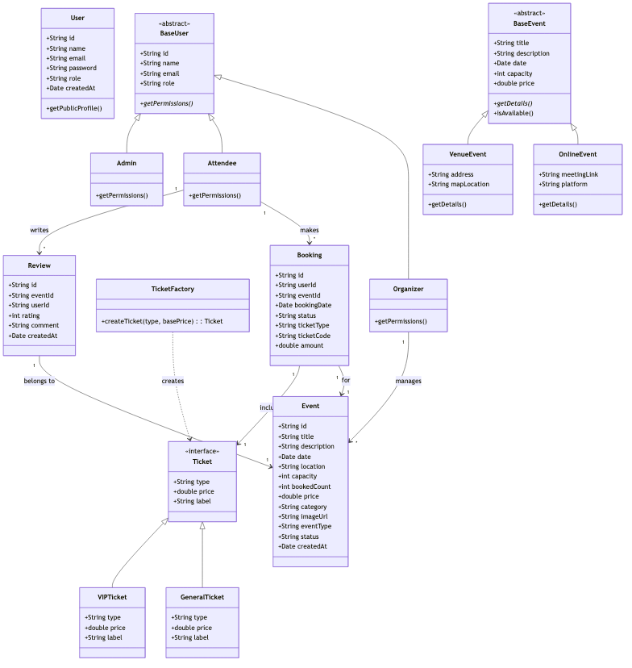
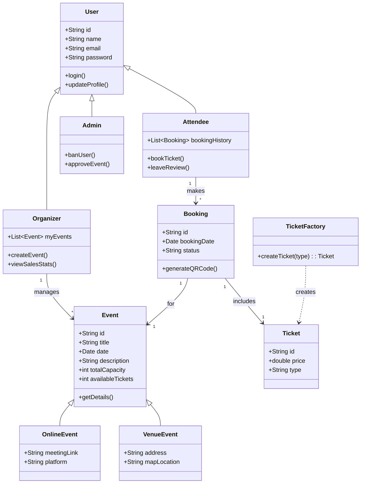

# Class Diagram

The following class diagram outlines the **Object-Oriented Structure** of the system, highlighting Inheritance (UserRoles), Factory Pattern (TicketFactory), and Relationships.

Mermaid Source

