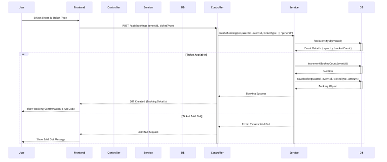
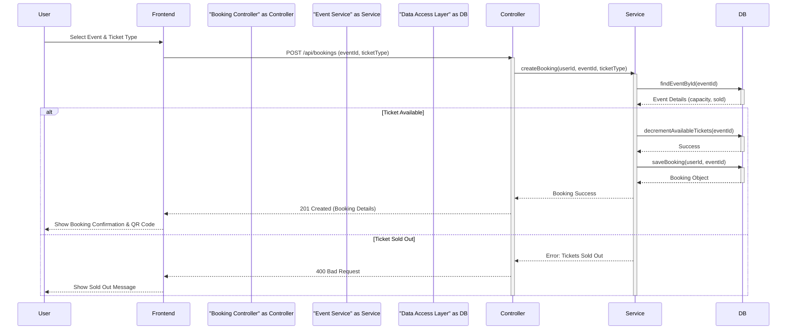

# Sequence Diagram

This diagram visualizes the **Ticket Booking Flow**, demonstrating how the Controller, Service, and Database layers interact to handle bookings and concurrency.

Mermaid Source

