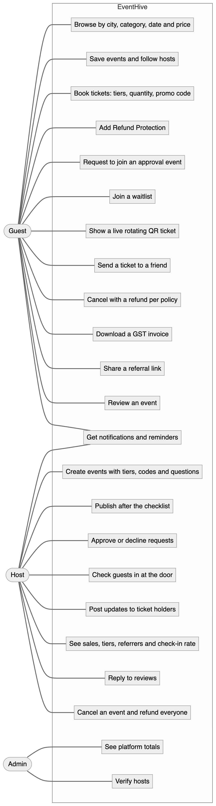
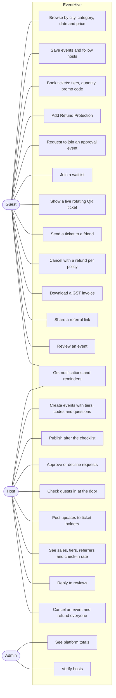

# Use Case Diagram

What each actor can do in EventHive v2.

Mermaid Source

```mermaid
graph LR
    Guest([Guest])
    Host([Host])
    Admin([Admin])

    subgraph EventHive
        direction TB
        D1[Browse by city, category, date and price]
        D2[Save events and follow hosts]
        B1[Book tickets: tiers, quantity, promo code]
        B2[Add Refund Protection]
        B3[Request to join an approval event]
        B4[Join a waitlist]
        T1[Show a live rotating QR ticket]
        T2[Send a ticket to a friend]
        T3[Cancel with a refund per policy]
        T4[Download a GST invoice]
        S1[Share a referral link]
        S2[Review an event]
        N1[Get notifications and reminders]

        H1[Create events with tiers, codes and questions]
        H2[Publish after the checklist]
        H3[Approve or decline requests]
        H4[Check guests in at the door]
        H5[Post updates to ticket holders]
        H6[See sales, tiers, referrers and check-in rate]
        H7[Reply to reviews]
        H8[Cancel an event and refund everyone]

        A1[See platform totals]
        A2[Verify hosts]
    end

    Guest --- D1 & D2 & B1 & B2 & B3 & B4 & T1 & T2 & T3 & T4 & S1 & S2 & N1
    Host --- H1 & H2 & H3 & H4 & H5 & H6 & H7 & H8 & N1
    Admin --- A1 & A2
```

