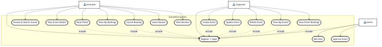
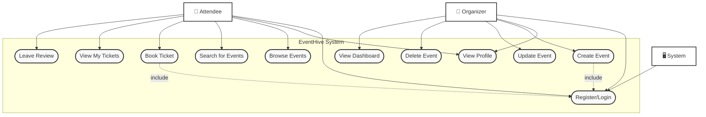

# Use Case Diagram

The following diagram illustrates the interactions between the **Attendee**, **Organizer**, and **System** actors within the EventHive application.

Mermaid Source

```mermaid
graph TD
    %% Actors
    A[👤 Attendee]
    O[👤 Organizer]
    S[🖥️ System]

    %% System Boundary
    subgraph EventHive_System [EventHive System]
        direction TB
        UC1([Register/Login])
        UC2([View Profile])
        
        UC3([Browse Events])
        UC4([Search for Events])
        UC5([Book Ticket])
        UC6([View My Tickets])
        UC7([Leave Review])

        UC8([Create Event])
        UC9([Update Event])
        UC10([Delete Event])
        UC11([View Dashboard])
    end

    %% Relationships
    A --> UC1
    A --> UC2
    A --> UC3
    A --> UC4
    A --> UC5
    A --> UC6
    A --> UC7

    O --> UC1
    O --> UC2
    O --> UC8
    O --> UC9
    O --> UC10
    O --> UC11

    %% Includes (represented as dotted lines)
    UC5 -.->|include| UC1
    UC8 -.->|include| UC1
    
    S --> UC1

    %% Styling to mimic Use Case Diagram
    classDef actor fill:#fff,stroke:#333,stroke-width:2px;
    classDef usecase fill:#f9f9f9,stroke:#333,stroke-width:2px,rx:20,ry:20;
    
    class A,O,S actor;
    class UC1,UC2,UC3,UC4,UC5,UC6,UC7,UC8,UC9,UC10,UC11 usecase;
```

